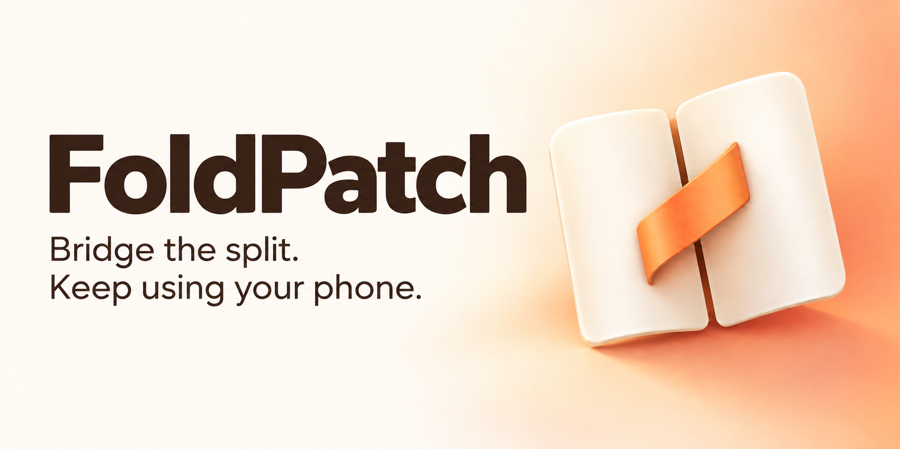
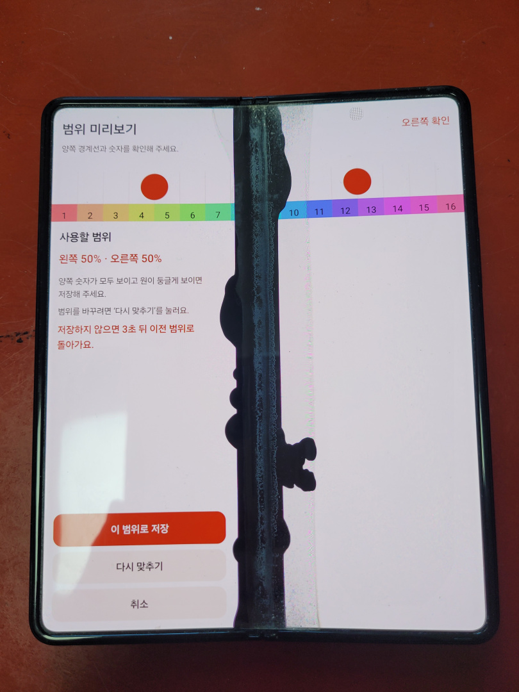
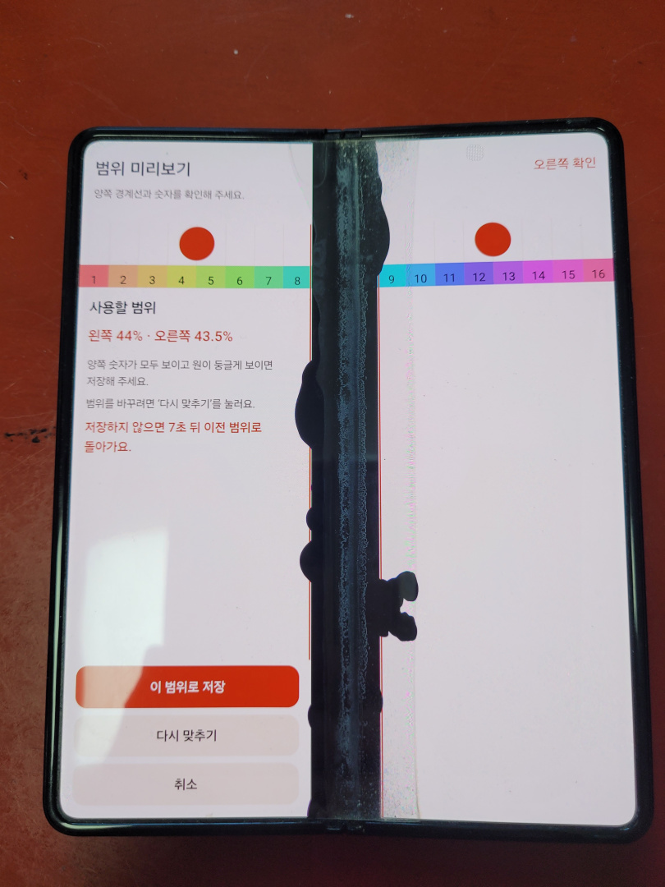
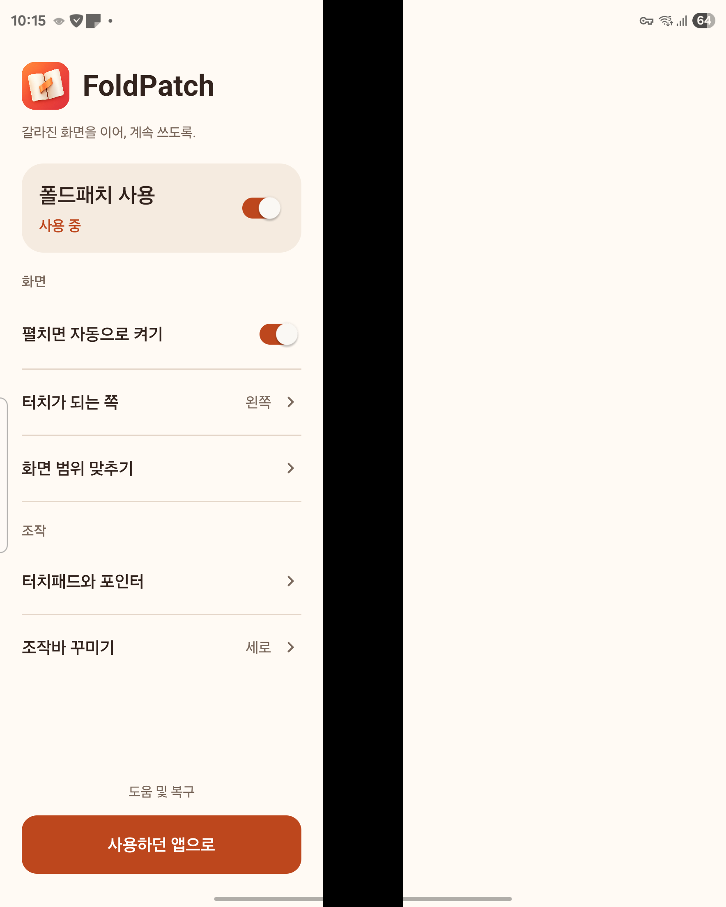
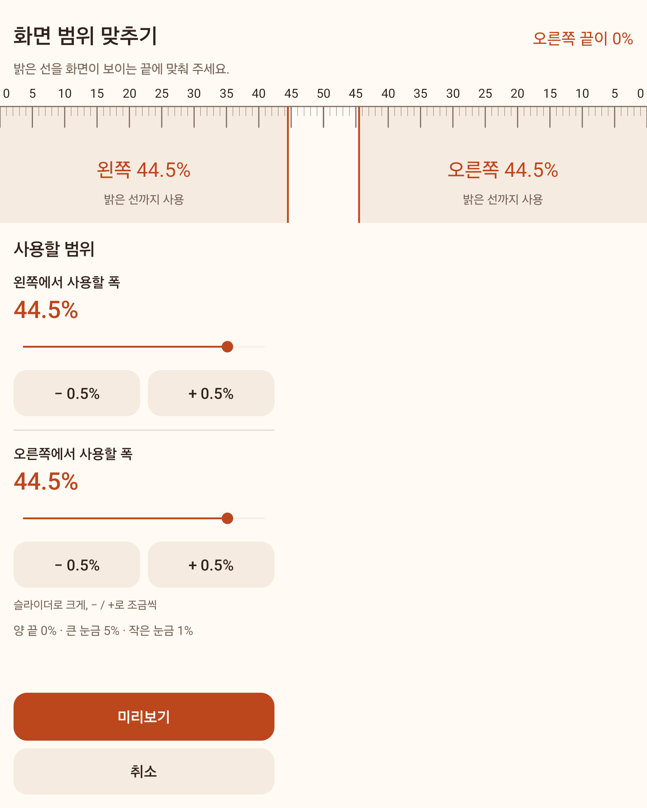
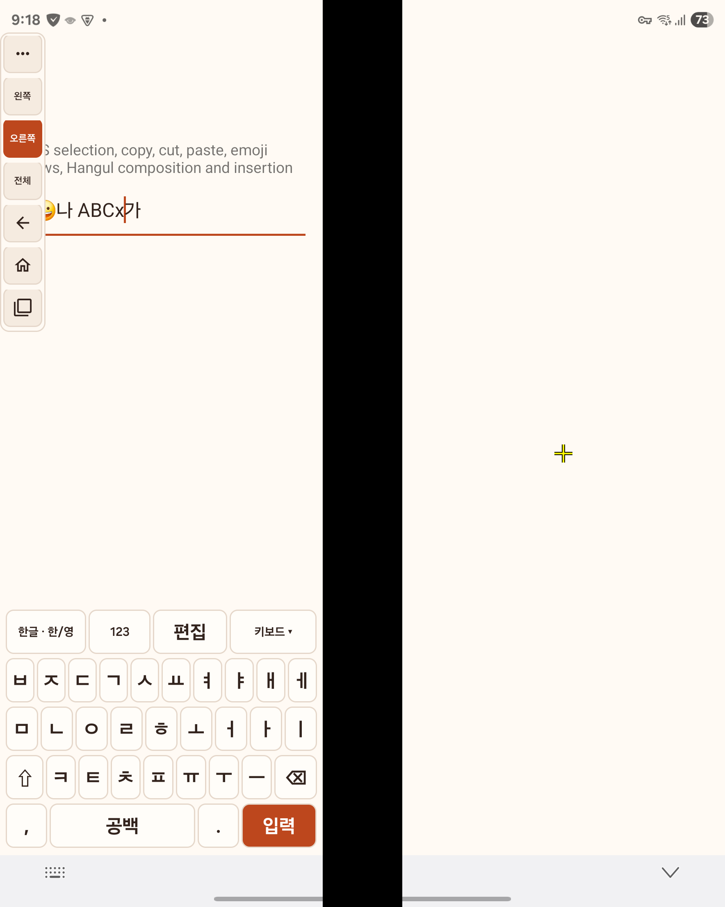

# FoldPatch

[English](README.md) · [한국어](README.ko.md) · **日本語** · [简体中文](README.zh-Hans.md) · [繁體中文](README.zh-Hant.md)

**[APK をダウンロード](https://github.com/att083/FoldPatch/releases/download/v0.1.0-alpha.5/foldpatch-release.apk)** · [インストール手順](docs/INSTALL.ja.md) · [対応状況（英語）](docs/COMPATIBILITY.en.md)

**中央が映らなくなり、片側しかタッチできない折りたたみスマートフォンを使い続けるための Android アプリです。**

開発者自身の Galaxy Z Fold3 が故障したことをきっかけに生まれたオープンソースアプリです。すぐに修理できなくても、同じ状況の人が残った画面で端末を使い続けられることを目指しています。[開発の背景と関連ツール（英語）](docs/WHY.en.md)。

## 画面範囲の調整前・調整後

| 調整前：左 50%・右 50% | 調整後：左 44%・右 43.5% |
| --- | --- |
|  |  |

**Galaxy Z Fold3・Android 15 の実機写真。** [Chrome と分割画面の使用前・使用後の写真（英語）→](docs/REAL_USE.en.md)

## できること

- **映る部分に画面をつなげて表示。** 左右の使える幅を合わせた画面サイズをアプリに渡し、その画面を壊れた中央部分を避けて表示します。横方向に押しつぶす方式ではありません。全画面のアプリも、いつもの分割画面も使えます。
- **片側から両側を操作。** タッチできる側を左右から選び、タッチパッドとして反対側や画面全体をクリック・ドラッグ・スクロール・拡大縮小できます。
- **タッチできる側で文字入力。** 片側に収まるキーボードで、左右どちらの入力欄にも入力できます。コピー・貼り付けなどの編集機能もあります。

左右の表示幅、ツールバーの大きさや位置を調整できます。端末を開くと自動で FoldPatch をオンにする設定もあります。

  
  
  

左から **設定・画面範囲の調整・キーボードとツールバー**。Galaxy Z Fold3 / Android 15 の実機キャプチャで、表示言語は韓国語です。キーボードの背景は入力テスト画面です。画像を選ぶと元のサイズで表示します。

## 自分の端末で使える？

現在の対象は **縦向きの内側画面**です。左右に映る部分があり、少なくとも片側でタッチが反応する必要があります。各側の表示幅は、外側の端から内側へ測って画面全幅の 20–50% に設定できます。両側を 50% にすれば、壊れていない画面でも全体を表示したまま片側をタッチパッドとして使えます。

| 環境 | 確認状況 |
| --- | --- |
| Galaxy Z Fold3・Android 15 / One UI 7 | 実機で確認 |
| Android 16/17 | エミュレーターのみ。実機では未確認 |
| その他の折りたたみ端末 / Android 15+ | 動作未確認 |

インストールには Android 15 以上が必要です。機種差や未確認の動作は [対応状況（英語）](docs/COMPATIBILITY.en.md)をご覧ください。スクリーンリーダーとの同時使用には対応していません。

**[Shizuku](https://shizuku.rikka.app/download/) のインストールと起動が必要です。** 初期設定には信頼できる Wi-Fi とワイヤレスデバッグを使います。root 化やパソコンの常時接続は不要です。端末を再起動した後は、Shizuku の起動し直しが必要になることがあります。

## 使い始める

**用意された APK をインストールするだけで、ビルド環境は不要です。** 現在は初期アルファ版です。

1. **[foldpatch-release.apk](https://github.com/att083/FoldPatch/releases/download/v0.1.0-alpha.5/foldpatch-release.apk)** をダウンロードしてインストールします。
2. FoldPatch の案内に従い、タッチできる側を選び、Shizuku・権限・キーボードを準備します。
3. 端末を開いて左右の表示幅を調整・保存し、いつものアプリに戻ります。

最初の準備は、端末を閉じたまま外側の画面でも進められます。**[インストール・ジェスチャー・復元の手順 →](docs/INSTALL.ja.md)**

**AI にスマートフォンへのインストールを頼む場合：** Codex、Claude Code などに [AI 向けインストールガイド（英語）](docs/AGENT_INSTALL.en.md)を読んでもらってください。次の依頼文をコピーして使えます。

> このリポジトリの `docs/AGENT_INSTALL.en.md` を読み、スマートフォンに FoldPatch をインストールしてください。実行できる作業は進め、端末で私の操作が必要なときに教えてください。既存のアプリデータと設定は保持してください。

画面の言語は OS 設定に合わせて韓国語・英語・日本語・簡体字中国語・繁体字中国語に切り替わります。**キーボード入力は韓国語と英語のみです。** インターネット権限、広告、アクセス解析 SDK はありません。[プライバシーと権限（英語）](PRIVACY.en.md)。

## 改善に協力する

設定で迷ったところや、お使いの端末での動作報告が役立ちます。翻訳・ドキュメント・コードへの貢献も歓迎します。[貢献ガイド（英語）](CONTRIBUTING.md)。

[ビルド（英語）](docs/BUILD.en.md) · [構成（英語）](docs/ARCHITECTURE.en.md) · [今後の課題（英語）](docs/BACKLOG.en.md)

[Apache License 2.0](LICENSE) · [第三者の著作権表示（英語）](THIRD_PARTY_NOTICES.md)
