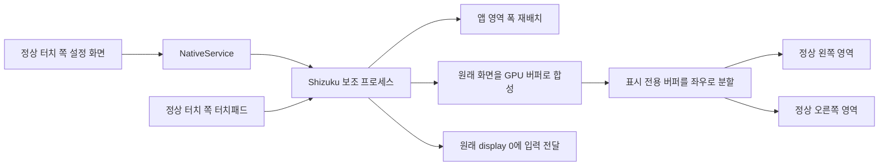

# 구조와 복구

[English](ARCHITECTURE.en.md)

현재 일반 실행 경로는 `NativeActivity → NativeService → Shizuku ShellBridge → NativeScreen`입니다. 사용 중인 앱을 VirtualDisplay로 옮기지 않습니다.

## 화면

예를 들어 물리 폭이 1768px이고 정상 영역이 양쪽 40%라면 약 1414px의 앱 영역으로 재배치합니다. 그 영역을 잘라 양쪽으로 1:1 표시합니다. 시스템 물리 해상도·입력 viewport·밀도를 바꾸지 않습니다. 기존 화면 구조에서는 상태바·알림창의 시스템 영역에 별도의 균일 축소를 적용합니다. Android 17에서 확인한 공통 부모 구조에서는 앱·상태바·알림창의 폭을 함께 다시 배치합니다. `ReflowPolicy`가 화면 트리와 점유 상태로 경로를 선택하며 OS 버전만으로 추측하지 않습니다.

양쪽을 50%로 설정하면 원래 화면 전체를 그대로 사용합니다. 이 경우 `NativeScreen`은 포인터용 투명 오버레이만 만들며, 화면 영역 소유권·폭 변경·미러 버퍼·시스템 UI 축소를 사용하지 않습니다. 터치패드와 좌표 전달은 같은 경로를 사용하되 가운데 간격이 0이므로 좌표 이동량도 0입니다. 손상 구간이 있는 설정과 전환할 때는 기존 화면 변경을 먼저 복구합니다.

`AreaOrganizer`는 영역 추가·소유권 상실 알림을 받으면 현재 세션을 무효화합니다. 다른 조직자가 소유권을 가져갔으면 그 영역을 다시 변경하지 않고 복구 기록을 남겨, 해당 영역이 해제된 후 원복합니다. `ReflowGuard`는 파일 잠금으로 동시 실행을 막으며 복구 기록에 경로와 원래 크기·적용 크기를 저장합니다. 이전 버전의 3개 숫자 형식은 기존 경로의 기록으로 읽습니다. 시스템 API에 원자적 ‘비어 있을 때만 확보’ 기능이 없어 시작 전 점유 확인과 등록 사이의 경쟁 가능성까지 완전히 제거한 것은 아닙니다.

`ReflowGuard`가 임시 display-area 범위를 소유하고 부모 프로세스의 heartbeat를 확인합니다. 기존 시스템 organizer가 점유한 영역을 교체하지 않도록 확인합니다. shell 보조 프로세스에서만 숨겨진 시스템 API를 호출합니다. 이 API와 삼성 화면 구조에 대한 의존성 때문에 OS·제조사 호환성을 별도로 검증해야 합니다.

`FrameMirror`는 앱을 옮기지 않고 원래 화면을 전용 출력 디스플레이의 BLAST 버퍼로 합성합니다. CPU 읽기·영상 인코딩 없이 그 버퍼만 좌우로 잘라 접근성 overlay에 표시합니다. 표시 화면에는 앱의 입력 창 복제본이 없으며, 표시 전용 층은 trusted overlay로 설정해 원래 앱으로 향하는 입력을 가리지 않습니다. 원래 창의 입력·가림 정책은 유지됩니다. 보호된 콘텐츠의 표시는 보장하지 않습니다. 출력 디스플레이와 버퍼는 접기·종료·연결 해제 시 해제합니다. 알림창 아래 여백은 모서리의 배경 픽셀을 확장하며 원본 시스템 창이 입력을 처리합니다.

## 입력과 키보드

폴드패치가 켜져 있으면 접근성 motion-event 입력으로 실제 손가락 동작을 받습니다. `TouchSide`가 정상 터치 쪽과 15초 미확정 변경 복구를 관리합니다. 조작 대상 0/1/2는 물리적인 왼쪽/오른쪽/전체를 뜻합니다. 터치패드 제스처는 하나의 원본 화면 좌표계에서 계산하고, 일반 터치·키보드·조작바도 표시 위치에서 원본 위치로 변환해 전달합니다. 손상 영역에서 시작한 입력은 버립니다. 주입된 입력은 하드웨어 필터를 다시 거치지 않습니다.

`TrackpadGesture`는 이동, 클릭·더블클릭, 길게 누르기, 탭 후 누른 채 끌기, 누른 채 기다린 뒤 끌기, 모든 방향 스크롤, 핀치를 인식합니다. 두 손가락이 함께 이동하면 한 손가락 스크롤 스트림을, 거리가 변하면 포인터를 중심으로 두 손가락 터치 스트림을 만듭니다. 핀치 중 방향 변화도 전달합니다. 손가락 추가·해제·취소 시 Android의 DOWN/POINTER_DOWN/POINTER_UP/UP/CANCEL 순서를 보장합니다. 효과는 대상 앱의 제스처 지원에 따릅니다.

`ReachKeyboard`는 Android 입력기입니다. 선택한 쪽의 정상 폭에 맞추며 오른쪽에서는 재배치된 원본 폭을 기준으로 위치와 실제 입력 영역을 함께 옮깁니다. 기존 키보드 식별자를 보관하고 폴드패치 해제 시 복구합니다. 모든 강제 종료·Shizuku 종료 조합에서 키보드가 즉시 돌아온다고 보장하지 않으므로 수동 복구 안내도 제공합니다.

## 실패 시 복구

- 앱 Binder 연결 종료: 화면과 앱 영역 해제, 이전 키보드 복구 시도.
- 보조 프로세스 연결 종료: 살아 있는 Shizuku에 자동 재연결. 연결 요청 5초 만료·지연 재시도·오래된 콜백 무시.
- 화면 제어 응답 10초 초과: 본인 보조 프로세스 재시작 시도(최소 60초 간격). Shizuku 자체를 시작하는 기능은 아님.
- 앱 내부 연결 기록: 고정된 연결·화면 준비·접기·잠금 이벤트와 시각만 기록. 파일당 약 16KB, 최근 2개 파일. 화면·입력 글자·네트워크 정보는 기록하지 않음.
- 보조 프로세스 종료 또는 heartbeat 만료: ReflowGuard가 임시 범위 해제.
- 커버 화면·잠금·화면 꺼짐·가로 회전: 폴드패치 해제.
- 범위 미리보기 미저장: 15초 후 원복. 프로세스 재시작 시 미확정 범위 복구.
- 초기 설정 실패: 화면층·overlay 정리와 해제 요청.

강제 종료 뒤 자동 재실행을 의미하지 않습니다. `auto_open`은 접기/펼치기 기반 시작 설정이며 Shizuku 시작을 대신하지 않습니다.

## 권한 경계와 개발 코드

Binder 호출은 FoldPatch UID를 검사하고 허용된 작업만 처리합니다. debug 빌드의 ADB 등록 provider는 DUMP 권한과 shell UID로 제한됩니다. release 빌드에서는 등록하지 않습니다.

과거 VirtualDisplay·GL 실험 코드는 비교와 참조를 위해 남아 있습니다. `MainActivity`, `ReachService`, `ControlPanel` 등의 경로이며 일반 앱 시작에는 사용하지 않습니다. release에서는 MainActivity를 외부 앱이 열 수 없고, ProbeActivity·InputProbeActivity·LatencyProbeActivity도 manifest에서 제외합니다. 현행 성능이나 사용자 기능을 설명할 때 이전 실험 결과와 섞지 않습니다.
