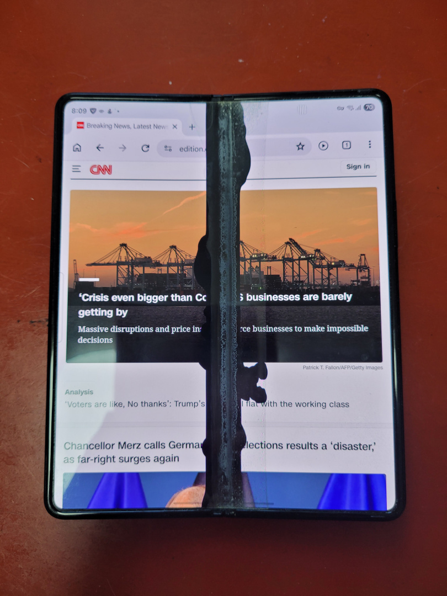
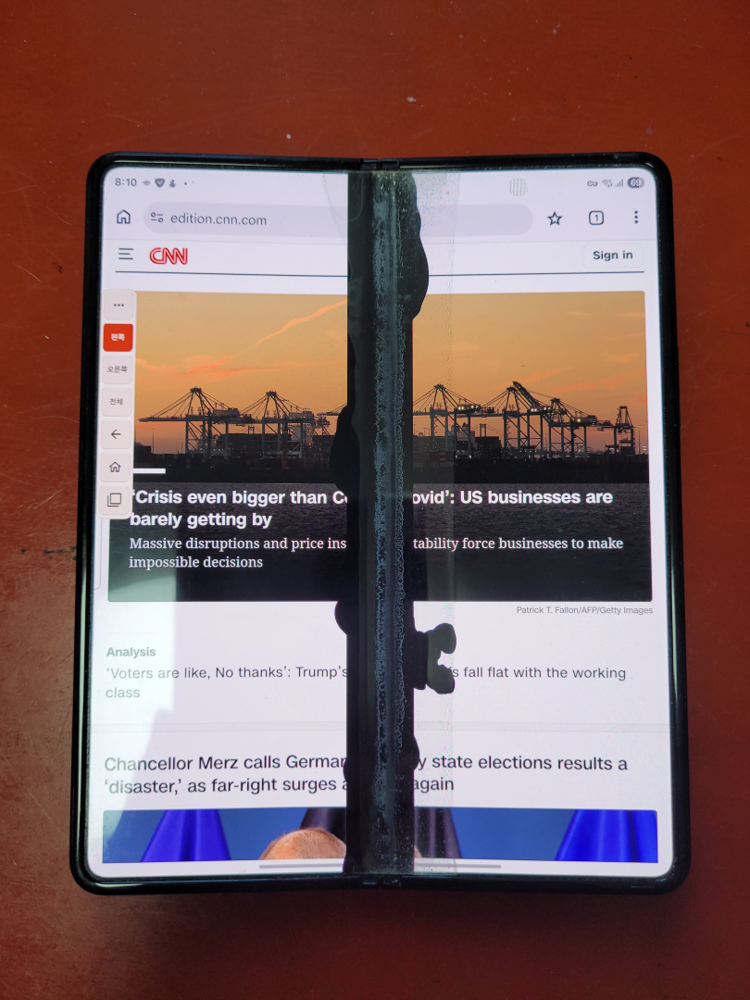
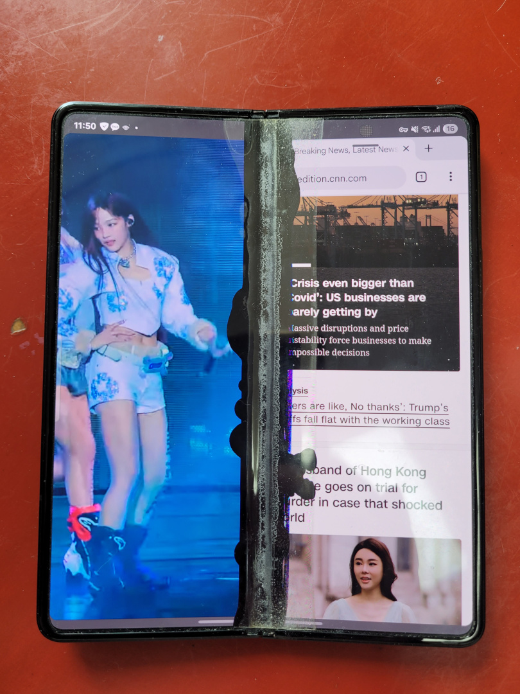
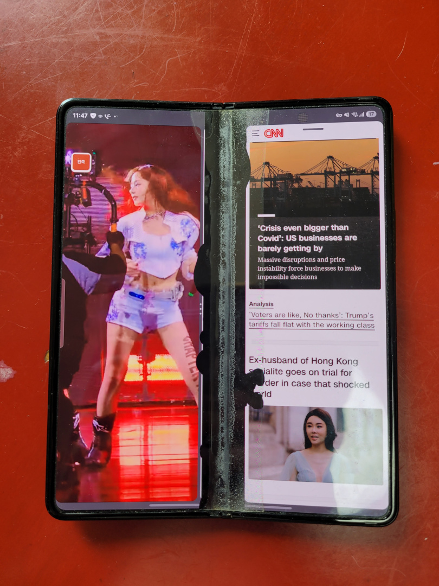

# Before and after in use

[한국어](REAL_USE.md) · [README](../README.md)

These are photographs of the **Galaxy Z Fold3 / Android 15 / One UI 7** used for development, with a damaged center display. The supplied photo files are reproduced unchanged. Select an image to view it at its original size.

## Full-screen Chrome

| Before FoldPatch | After FoldPatch |
| --- | --- |
|  |  |

The same webpage reflows to the combined usable width. Text wraps differently because the app receives a narrower layout, rather than being squashed horizontally. The black area remains: it is physical panel damage.

## YouTube on the left, Chrome on the right

| Before FoldPatch | After FoldPatch |
| --- | --- |
|  |  |

The existing left/right app arrangement is preserved while the usable width changes. These photographs were taken at different moments, so the video frame and browser toolbar state differ.

## Screen-area preview

| Before adjustment: left 50% · right 50% | After adjustment: left 44% · right 43.5% |
| --- | --- |
|  |  |

Both photos show FoldPatch's screen-area preview. At 50% + 50%, no center gap is reserved. After reducing the widths, the previously obscured numbers 8 and 9 are visible on the two sides. These settings suit the photographed phone; adjust them while looking at your own display.

The webpage and video are examples of existing apps in use. These photos document screen layout; see the [validation record](RELEASE_REVIEW.en.md) for input, recovery and device coverage.
